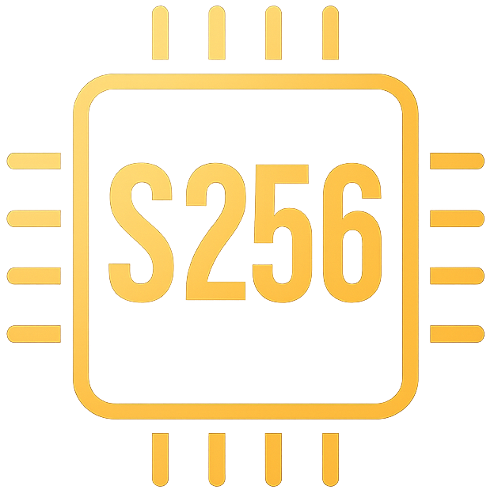

# S256 Coin Web Wallet v2.0

A modern, secure, and modular web wallet for S256 coin. This version introduces significant architectural improvements, seed phrase support, and a built-in migration tool.

<p align="center">
  
</p>

<p align="center">
  <strong>The Official Web Wallet for SHA256coin (S256)</strong><br>
  Built with Flutter for Web
</p>

<p align="center">
  <a href="https://sha256coin.eu">Website</a> •
  <a href="https://explorer.sha256coin.eu">Explorer</a>
</p>

## Major Updates in v2.0

### 🏗️ Modular Architecture
The project has been refactored from a monolithic structure to a scalable, modular architecture using the **Provider** pattern:
- **Models**: Structured data objects for Wallets and Transactions.
- **Providers**: Centralized state management for UI reactivity.
- **Services**: Dedicated logic for cryptography, storage, and RPC communication.
- **Screens**: Dedicated UI layers for Welcome, Setup, Dashboard, and Network Info.

### 🌱 Seed Phrase Support (BIP39)
Moving beyond raw private keys, the wallet now supports modern **BIP39 Seed Phrases**:
- **Generate 12 or 24 words**: Choose your desired security level.
- **BIP44 Derivation**: Industry-standard derivation paths for maximum compatibility.
- **Secure Backup UI**: Dedicated interface to ensure users save their phrases correctly.

### 🔄 WIF-to-Seed Migration (Sweep)
A unique tool to help legacy users upgrade to modern security:
- **Automatic Sweep**: Transfer all funds from a legacy WIF key to a new Seed-derived address in one click.
- **Smart Handling**: If the wallet is empty, it upgrades the wallet type instantly without requiring a blockchain transaction.
- **Forced Backup**: Automatically prompts the user to secure their new keys post-migration.

### 📊 Real-time Network Info
A new dashboard to monitor the S256 network health directly within the wallet:
- **Blockchain Stats**: Height, Difficulty, and Median Time.
- **Mempool Metrics**: Pending transaction count and size.
- **Mining Data**: Global network hashrate with automatic unit conversion (GH/s, TH/s).

### 🛡️ Enhanced Security
- **In-Memory Storage**: Sensitive keys now live only in the application's RAM.
- **Refresh Protection**: Refreshing the browser (F5) now clears the session and logs the user out, preventing "partial state" mnemonic loss.
- **Zero Leaks**: All debug prints and sensitive logs have been removed for production.
- **CORS-Ready RPC**: Improved RPC communication that works seamlessly with secure proxies.

## Features

- **Seed Phrase Wallet**: Modern 12/24 word recovery phrases (Recommended).
- **Legacy WIF Wallet**: Support for existing raw Private Keys (WIF).
- **Send/Receive**: Full transaction support with Bech32 (s21...) addresses and QR codes.
- **Glassmorphism UI**: A sleek, dark-themed interface with neon purple and gold accents.

## Security Warning

⚠️ **Web wallets are intended for convenience, not long-term high-value storage.**

- Private keys exist ONLY in memory during your active session.
- Closing the tab or refreshing the page logs you out instantly.
- Always verify the URL is `https://sha256coin.eu`.
- For large amounts, always use a desktop or hardware wallet.

## Development

Run locally:
```bash
flutter run -d chrome
```
or
```bash
flutter run -d web-server --web-port 8080
```

## Building for Deployment

Build the web app:
```bash
flutter build web --release --base-href "/web-wallet/"
```

## RPC Configuration

The wallet uses an RPC proxy to communicate with S256 nodes. By default the project expects a secure proxy endpoint such as `https://sha256coin.eu/rpc` (or your own proxy).

The proxy must:

- Serve over HTTPS.
- Return a single `Access-Control-Allow-Origin` header matching `https://sha256coin.eu/` (or the origin you host the wallet from).
- Handle preflight `OPTIONS` requests and forward POST JSON-RPC payloads to an upstream node.

## License

MIT License.
